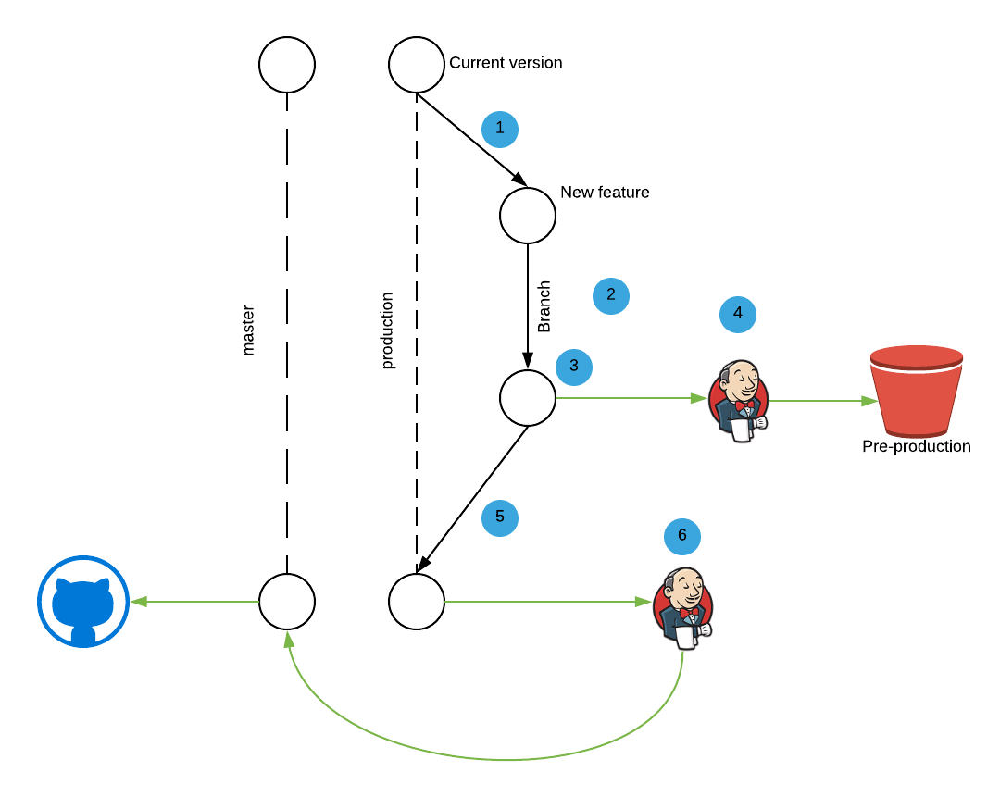

Today, I will present how to we build this website and why use this components.

## Presentation of Gatsby

Gatsby is static site generator based on React and GraphQL. The community propose a lot of plugins like parsing markdown, google analytics, sitemap…

The workflow for building the website :

For more information you can visit the official website [https://www.gatsbyjs.org/](https://www.gatsbyjs.org/).

## Why we choose gatsby

### Our pre-requirement

* We want to deploy the website on github.io. github.io can only serve static website or dynamic with managed service like firebase.
* We want to manage versioning through git.
* We want to manage the website with continuous deployment and validate new features in pre production.

### Gatsby functionality we love

* Based on React, we choose React for Centreon Web, it’s a technology we known.
* We can build a version based on a branch and deploy this one on pre-production
* Native implementation of PWA, I love read my article in the subway.
* Easy to implement.

## Our development workflow

1. Create a branch for a new feature or content
2. Development the new feature
3. Create a pull-request of the feature
4. Automatically the CI build and deploy on pre-production
5. Once the development is validated, merge the branch on the master
6. Automatically the CI build and deploy on production

Each R&D member can create and publish some content : an article, an event or add a new feature.
We have a pre-production platform who is built for each content to test the good integration and the render of the new content.
The markdown give us a easy way to write and to version an article.

In the next article, I will explain some technical integration of Gatsby plugins and how work the generation in Gatsby.
