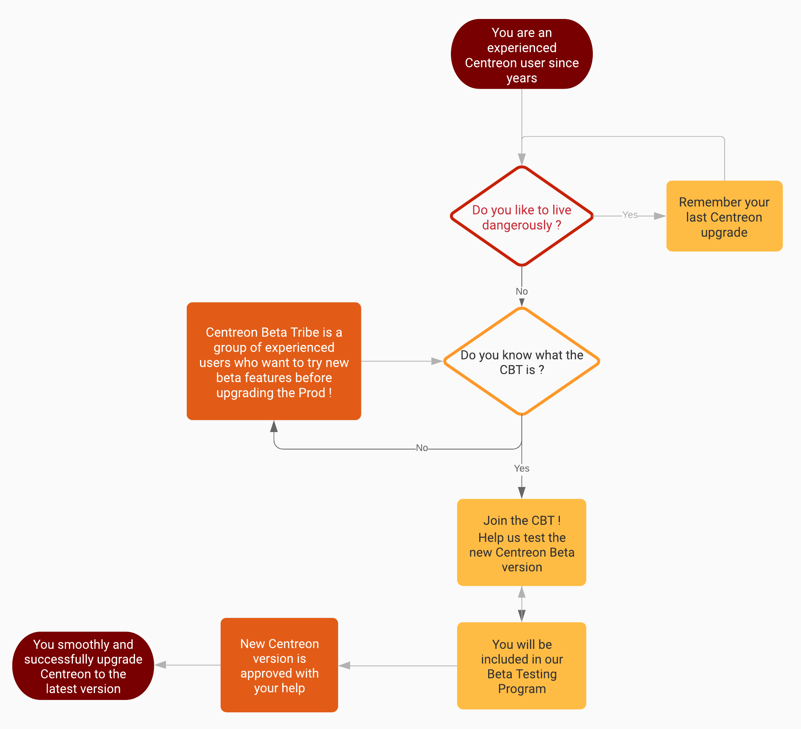

## Hello our beloved Community!

We have a new and exclusive deal for you! But wait, please take a look at the following diagram first!

### What do CBT and BTP stand for? 

Indeed, we’d like to invite you to participate in this BTP (Beta Testing Program) by installing the beta package, trying out the new features, and submitting issues.

Yes! That means that you will be part of the CBT (Centreon Beta Tribe) and you will have an early access to our beta features. Of course, we need your help and feedback to improve our development and achieve our goals.

Wait! There's another thing too! Getting involved in the BTP could be nice but what would be the real benefits? When you join our BTP, you'll enjoy the following privileges:

 * Getting a look at the new features before others (and before deploying them on PROD too)!
 * Getting the power of finding unsuspected bugs before anyone else;
 * Providing your feedback and suggestions during the development;
 * Improving the product as a result of testing and making it even better;
 * Receiving free licensed version of the paid modules for the duration of the program (and for the first registered beta testers only!);
 * Becoming *"The Best of The Best"* by winning the **Golden Ticket Challenge**[^1]
 * Receiving our eternal gratitude... until next version? :)
 * And of course, being able to upgrade smoothly and successfully your Centreon on PROD to the lastest version!

[^1]: The team will vote for the most difficult bug to be fixed (except all known bugs).

Does it sound good to you?

### Alright! How do I participate?

First, please go to the channel **\#betatesting** of our [community Slack workspace] (<https://centreon.slack.com>). If you don't have a Slack access yet, please get your invitation [here] (https://centreon.github.io/register-slack)!

Once connected, please notify @TUD or @Adrien that you want to participate in the BTP, they will give you the key to open the door to the wonderful world of Centreon Beta.

*Why is it so complicated?* Because we would like to make sure that you are the *Chosen One*! As you will be the one who are getting involved in the next Centreon version, please do not forget that ***"with great power comes great responsibility"***! Indeed we need your feedback about your Centreon usage in <strong>your real environment</strong>.

### Before you enroll

One last but not least thing before starting, be sure to read carefully, understand and accept the Terms and Conditions of the Beta Test Agreement as following:

 * The beta software can be inherently unstable and is not fully tested or supported.
 * The implementation of beta software should be limited only in staging or test environment.
 * The beta testers shall respect fully all the Terms and Conditions of the current product.
 * The beta testers agree to provide reasonnable feedback or report any and all problems and test results relating to the beta version. All this information may be used by Centreon for its own purpose.
 * The beta testers understand that Centreon could not provide assurance that any specific errors or expected behaviors by users will be corrected or included in the final version.
 * The beta testers agree to validate the test plan (or defined test perimeter) that will be assigned within the requested period of time (that would be agreed and defined with the QA team).
 * The beta testers shall keep all privileges (early access, licences, etc.) and information obtained through the program for their own usage only. Indeed please wait for the official release before communicating about it!

### OK, but how can I accept the agreement?

It's very easy! The QA team members will give a link to the forms that we created with [Framaforms](https://framaforms.org/). Nothing special here! There is just a form in order to know that you want to <strong>get in or get out</strong> the program.

### Are you ready? Go!

We are waiting for you on the channel **\#betatesting**! Thank you in advance for your help and feedback!

\#monitoringlove

The Centreon Q&A Team.